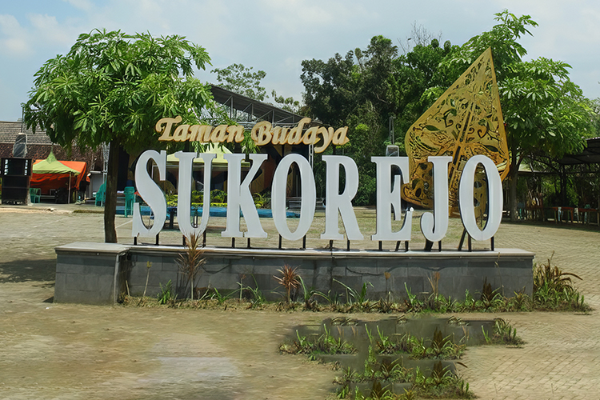

# Website Promosi Desa Wisata Kampung Jawa Sukorejo

## Deskripsi Proyek

Ini adalah website *front-end* statis yang dirancang untuk mempromosikan **Kampung Jawa Sukorejo (KJS)**, sebuah desa wisata budaya yang berlokasi di Sukorejo, Tuban. Website ini berfungsi sebagai gerbang digital untuk memperkenalkan sejarah, filosofi, kegiatan budaya, serta paket wisata yang ditawarkan kepada calon pengunjung.

Tujuan utama dari proyek ini adalah untuk menarik wisatawan dengan menyajikan informasi yang kaya, visual yang menarik, dan alur pengguna yang jelas, dari halaman utama hingga detail acara dan paket wisata.

---

## Pratinjau


*(Tips: Ganti `hero-background_.jpg` dengan screenshot halaman utama yang lebih representatif jika Anda mau)*

---

## Fitur Utama

-   **Halaman Beranda (`index.html`):** Berisi *hero section* yang menarik, pengenalan singkat tentang KJS, profil pengelola, ringkasan tiga paket wisata utama, dan cuplikan acara unggulan.
-   **Halaman Daftar Acara (`event-listing.html`):** Menyajikan daftar lengkap acara dan kegiatan budaya yang dilestarikan di desa, seperti Festival Seni Sukorejo (FSS) dan Tradisi Manganan, lengkap dengan deskripsi dan jadwal.
-   **Halaman Detail Paket Wisata (`paket-detail.html`):** Memberikan rincian mendalam untuk setiap paket wisata ("Sinau Sedino", "Ngleluri Budaya", dan "Pusaka Jawi"), termasuk fasilitas, program, harga, dan gambar yang relevan.
-   **Desain Responsif:** Dibangun dengan Bootstrap 5, memastikan tampilan optimal di berbagai perangkat, mulai dari desktop hingga ponsel.
-   **Interaktivitas:** Dilengkapi dengan animasi *hover* pada gambar, *sticky navigation bar*, dan tautan antar halaman yang fungsional untuk pengalaman pengguna yang lebih baik.
-   **Branding yang Konsisten:** Skema warna, tipografi, dan logo digunakan secara konsisten di semua halaman untuk membangun identitas visual yang kuat.

---

## Tumpukan Teknologi (Technology Stack)

-   **HTML5:** Untuk struktur konten website.
-   **CSS3:** Untuk penataan gaya kustom, termasuk skema warna, tata letak, dan animasi.
-   **Bootstrap 5:** Sebagai kerangka kerja utama untuk komponen UI dan desain responsif.
-   **JavaScript:** Digunakan oleh template asli untuk fungsionalitas dinamis seperti *sticky navbar* dan *animated headline*.
-   **Google Fonts (Poppins):** Untuk tipografi utama di seluruh situs.

---

## Struktur Proyek

```

.
├── css/
│   ├── bootstrap.min.css
│   ├── bootstrap-icons.css
│   ├── templatemo-tiya-golf-club.css
│   └── style.css
├── js/
│   ├── animated-headline.js
│   ├── click-scroll.js
│   ├── custom.js
│   ├── jquery.min.js
│   ├── jquery.sticky.js
│   └── modernizr.js
├── images/
│   ├── FSS.JPG
│   ├── hero-background\_.jpg
│   ├── paket-ngleluri-budaya.jpg
│   ├── paket-pusaka-jawi.jpg
│   ├── paket-sinau-sedino.jpg
│   ├── profil-\*.jpg
│   └── ... (semua gambar lainnya)
├── index.html
├── event-listing.html
├── paket-detail.html
└── README.md

```

---

## Cara Menjalankan Proyek

Karena ini adalah website statis, tidak diperlukan instalasi atau server khusus. Cukup buka salah satu file `.html` (terutama `index.html`) langsung di browser pilihan Anda.

---

## Kustomisasi

Website ini dirancang agar mudah dimodifikasi:

-   **Mengubah Warna:** Skema warna utama (emas, cokelat, krem) dapat diubah dengan mudah di dalam file `css/style.css` pada bagian variabel `:root`.
-   **Mengubah Konten:** Semua teks (deskripsi, harga, jadwal, dll.) dapat diubah langsung di dalam file HTML yang relevan.
-   **Mengganti Gambar:** Untuk mengganti gambar, cukup letakkan file gambar baru di dalam folder `images/` dan pastikan nama filenya sesuai dengan yang dipanggil di dalam tag `` pada file HTML.

---

## Kredit

-   **Template Asli:** Desain dasar diadaptasi dari template "Tiya Golf Club" oleh [TemplateMo](https://templatemo.com/).
-   **Pengembangan & Kustomisasi:** Angga Wijanarko
-   **Konten & Foto:** Kampung Jawa Sukorejo.

```
